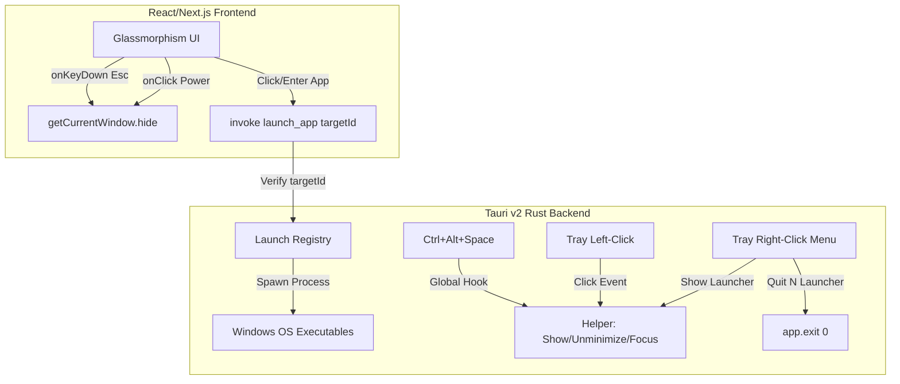

# N Launcher Clean Handoff File (After Phase 4)

## 1. Project Identity
* **Project Name**: N Launcher
* **Meaning of "N"**: Represents Novart / Novart Systems identity.
* **Project Type**: A side / personal / experimental Windows 11 companion launcher.
* **Build Environment**: Google Antigravity 2.0 (Windows 11 host environment).

---

## 2. Official Project Path
* **Correct Path**: `C:\Users\Administrator\Desktop\AntigravityProjects\N-Launcher`
* **Incorrect Path**: `C:\Users\Administrator\Desktop\Antigravity Projects\N-Launcher`
* **Warning**: The old path has a space (`.../Antigravity Projects/...`) and must not be used to avoid command compilation or path resolution errors.

---

## 3. Current Git State
* **Branch**: `master`
* **Remote Status**: No remote/GitHub repository configured yet.
* **Latest Commit**: `15186b7 Add Phase 4K tray menu controls`
* **Untracked Files**: 
  * `N-Launcher-Clean-Handoff-After-Phase-3.md` (historical handoff file)
  * `N-Launcher-Clean-Handoff-After-Phase-4.md` (this file)

---

## 4. Phase Summary

* **Phase 0 Architecture Planning**: Set architectural layout (Vite/Next.js frontend + Tauri v2 Rust backend). Established design systems, window behaviors, and security borders.
* **Phase 1 Static UI Shell**: Built the Next.js React frontend styling with glassmorphism CSS, flex list items, and basic search component.
* **Phase 2 Native Tauri Window**: Mapped raw window coordinates (340x840) to screen placement, always-on-top, skipTaskbar, and initial visibility rules.
* **Phase 2B Native Comfort Fixes**: Removed window frames and title borders (`decorations: false`), made background transparent, and adjusted overlay padding.
* **Phase 2C Escape-to-Hide**: Configured basic escape key capture. Pressing Escape dismisses the overlay window from visibility.
* **Phase 2D Search Autofocus**: Focused input immediately upon window show/focus to support instant keyboard typing.
* **Phase 3B Mock IPC**: Established React-to-Rust invoke channel mapping using Tauri core bindings.
* **Phase 3D File Explorer Launch**: Wired the `Files` target to execute `explorer.exe` safely from the Rust backend.
* **Phase 3F Terminal Launch**: Mapped the `Terminal` target to execute `wt.exe`.
* **Phase 3H VS Code Launch**: Built dynamic path resolution mapping to check User/System installation paths for VS Code (`Code.exe`) with `code.cmd` fallback.
* **Phase 3J Chrome Launch**: Mapped Google Chrome (`chrome.exe`) checks across 64-bit, 32-bit system directories, and user LocalAppData folders.
* **Phase 3M Notepad Launch and Spotify Removal**: Replaced the Spotify mockup item with a functional Notepad (`notepad.exe`) launcher target.
* **Phase 3N Final Regression PASS**: Verified all five launch targets and window hotkeys compiled and functioned correctly.
* **Phase 4B Tray Summon**: Configured tray left-click event listener to restore the launcher window.
* **Phase 4C Tray Regression**: Validated that clicking the tray icon restores window from hidden/minimized states.
* **Phase 4D Global Hotkey Review**: Evaluated hotkey listening methods.
* **Phase 4E Rust-only Global Hotkey Summon**: Configured Rust-side `tauri-plugin-global-shortcut` to map `Ctrl+Alt+Space` to launcher window restore.
* **Phase 4F Hotkey Regression**: Verified global hotkey summons the app regardless of current focus.
* **Phase 4G Footer Behavior Review**: Evaluated the utility footer power button behaviors.
* **Phase 4H Footer Power Hide**: Mapped the Power icon to invoke `getCurrentWindow().hide()`.
* **Phase 4I Footer Hide Regression**: Verified window hide maintains tray icon and hotkey registrations.
* **Phase 4J Tray Right-Click Menu Review**: Reviewed options for right-click tray menus.
* **Phase 4K Tray Menu Controls**: Configured Rust right-click context menu (Show Launcher, Separator, Quit N Launcher) and consolidated window show/focus helper.
* **Phase 4L Tray Menu Regression**: Verified all tray left-click, right-click, and exit sequences work perfectly.

---

## 5. Current Functional Controls

* **Escape Key Behavior**:
  1. *Tier 1*: Clears search text query if populated.
  2. *Tier 2*: Blurs the search input field if focused.
  3. *Tier 3*: Hides the native launcher window.
* **Footer Power Icon**: Hides launcher overlay (`getCurrentWindow().hide()`).
* **Settings Icon**: Visual-only icon shortcut (no action wired).
* **Tray Left-Click**: Restores, unminimizes, and focuses launcher.
* **Ctrl+Alt+Space**: Restores, unminimizes, and focuses launcher.
* **Tray Right-Click Menu**:
  * **Show Launcher**: Restores, unminimizes, and focuses launcher.
  * **(Separator)**: Visual divider.
  * **Quit N Launcher**: Exits the app cleanly via `app.exit(0)`.

---

## 6. Current Functional App List

Five native Windows launch targets are fully supported (all mock items have been removed):
1. **VS Code**: Resolves system/user folder installations, fallback to `code.cmd`.
2. **Terminal**: Spawns `wt.exe`.
3. **Chrome**: Resolves system/user folder installations, fallback to `chrome.exe` on PATH.
4. **Files**: Spawns `explorer.exe`.
5. **Notepad**: Spawns `notepad.exe`.

*All launchers receive only a safe `targetId` from the frontend, mapped to strict executables on the Rust side.*

---

## 7. Current Rust/Native Architecture



---

## 8. Current Security Boundaries
* **No `tauri-plugin-shell`**: Arbitrary shell spawns are disabled.
* **No Shell Permissions**: No shell execution permissions are declared.
* **No command interpreters**: Direct execution of `cmd.exe` or `powershell.exe` is barred.
* **No arbitrary shell execution**: Program commands are restricted to strict registered filenames.
* **No frontend path leak**: The frontend has no knowledge of paths, command arguments, or launch strings.
* **No cloud dependencies**: Offline, zero auth, zero database footprint.
* **No GitHub Remote**: Entirely local workspace.

---

## 9. Verification Results
* **`npm run build`**: **PASS**
* **`npm run tauri:dev`**: **PASS**
* **Tray Menu Regression**: **PASS**
* **Hotkey Summons**: **PASS**
* **App Executable Launches**: **PASS**
* **Escape Dismissal**: **PASS**
* **Quit & Clean Restart**: **PASS**

---

## 10. Recommended Next Phases

We recommend taking a review-only approach for next stages to plan and isolate architectural concerns safely:
* **Phase 5A: Startup Behavior Review only**: Review options to enable launch on Windows login (auto-run registry key, startup folder shortcut, or installer configuration) and explore settings toggle requirements.
* **Phase 5B: Packaging / Installer Review only**: Review WiX, NSIS, and MSIX packaging frameworks for Tauri v2 Windows delivery.
* **Phase 5C: Settings Scope Review only**: Design local configuration storage (JSON) structure and coordinate layout options for a future Settings overlay page.
* **Phase 5D: GitHub Remote Review only**: Design repository synchronization path, gitignore rules, and release flow.

---

## 11. Next Chat Starter Prompt

Copy and paste this starter prompt into the next session:

```text
We are continuing N Launcher development.

Official Project Path:
C:\Users\Administrator\Desktop\AntigravityProjects\N-Launcher

Latest Commit:
15186b7 Add Phase 4K tray menu controls

Current Status:
Phase 4L (Tray Menu Manual Regression) and Phase 4M (Handoff creation) are PASS.
All key controls (Escape dismissal, global Ctrl+Alt+Space shortcut, tray left-click restore, tray right-click Show/Quit menu, utility footer Power hide) are working as designed. All 5 application launchers are fully mapped and secure.

Safety boundaries remain intact: No tauri-plugin-shell, no shell permissions, no cmd.exe/powershell.exe interpreters, and no frontend-exposed command parameters.

We are ready for:
Phase 5A: Startup Behavior Review only.

Please check git status and git log --oneline -8, confirm path, and do not make any file modifications yet. Let's begin the review.
```

---

## 12. Suggested Antigravity Prompt for Phase 5A

```text
Goal: Startup Behavior Review only.

1. Do not edit files.
2. Do not implement any startup registry keys or startup shortcut generation.
3. Review startup options for N Launcher:
   A. Manual launch only (no automatic startup).
   B. Windows Startup folder shortcut (%APPDATA%\Microsoft\Windows\Start Menu\Programs\Startup).
   C. Registry auto-run key (HKCU\Software\Microsoft\Windows\CurrentVersion\Run).
   D. Installer-managed auto-launch on startup.
   E. Frontend settings checkbox communicating to Rust to toggle registry entry.
4. Compare complexity, user experience, reliability, and security implications of these options.
5. Recommend the safest and most transparent automatic startup approach.
6. Provide a Phase 5A Startup Behavior Review Report.
```
