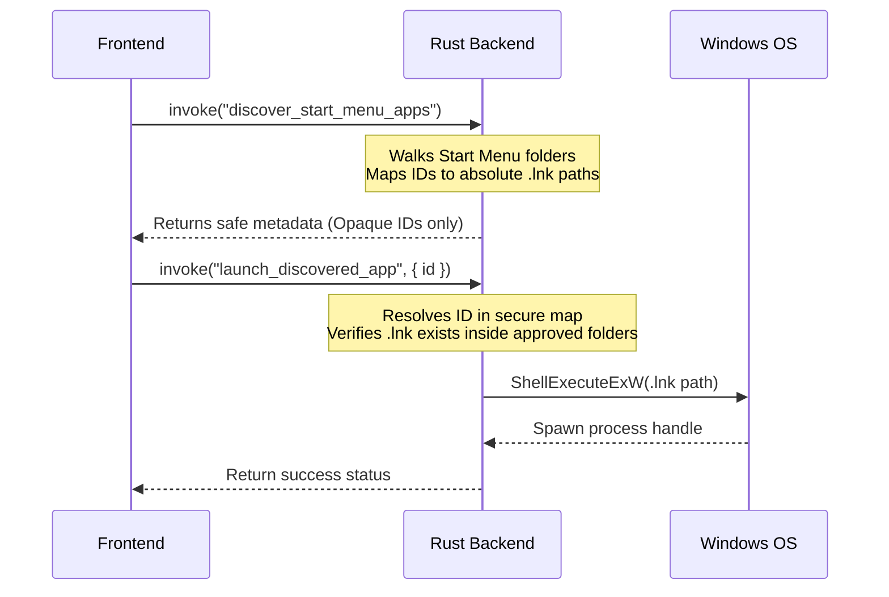

# Phase 9F — Safe Start Menu Launch Design Review

This document contains a comprehensive security and architectural review of the Windows Start Menu application launching design, ensuring that N Launcher preserves strict safety boundaries.

> [!NOTE]
> This phase is **design and documentation only** and does not implement launching.

---

## 1. Current State

### Built-in App Launch Model
- Built-in apps (VS Code, Terminal, Chrome, Files, Notepad) are resolved securely on the Rust backend.
- The frontend sends only a pre-defined ID (e.g. `"vscode"`).
- The backend translates this ID against a hardcoded list of verified registry targets (`REAL_TARGETS`) or mock templates, launching them via `std::process::Command::new()`. No execution details are exposed to the frontend.

### Start Menu Discovery Model
- Discovered apps are collected recursively by crawling:
  - System Programs: `C:\ProgramData\Microsoft\Windows\Start Menu\Programs`
  - User Programs: `%APPDATA%\Microsoft\Windows\Start Menu\Programs`
- Stems matching uninstallers or documentation files are ignored.

### Preview-only Behavior
- Discovered apps are merged into the frontend list with a `"Preview"` badge.
- Clicking or triggering Enter on these apps blocks launch execution and shows a safe status warning toast.

---

## 2. Current Discovery Flow
The Rust backend function `discover_start_menu_apps` performs the following steps:
1. Walks the directories using `std::fs::read_dir`.
2. Inspects files ending in `.lnk` (case-insensitive).
3. Extracts the file stem (e.g. `"Google Chrome"` from `"Google Chrome.lnk"`).
4. Generates a normalized ID by replacing spaces and hyphens with underscores, prefixed with `lnk_` (e.g. `lnk_google_chrome`).
5. Deduplicates list elements by normalized name.
6. Returns sorted metadata to the frontend.

---

## 3. Current Frontend Data Boundary
To maintain sandboxing, the frontend receives only:
- `id`: Opaque identifier string (e.g. `lnk_google_chrome`).
- `name`: Display name (e.g. `Google Chrome`).
- `normalizedName`: Lowercase version for search queries.
- `letter`: A-Z header index.
- `source`: `"startMenu"` discriminator.
- `kind`: `"app"`.
- `isPriority` & `isHidden` state flags.

---

## 4. Launch Risk Review

### Frontend-Controlled Executable Paths & Command Strings
If the frontend sends absolute executable paths (e.g. `C:\Windows\System32\cmd.exe`) or raw command strings to the backend, an attacker exploiting an XSS vulnerability in the web view could run arbitrary code on the host machine. The frontend must never have control over the executables or arguments executed.

### Shell Plugin Execution
Enabling the Tauri shell plugin (`@tauri-apps/plugin-shell`) allows the frontend to run commands directly. This introduces significant risks of remote code execution (RCE) if input is not sanitized. The shell plugin should remain disabled.

### Storing/Executing Stale `.lnk` Files
If a shortcut is deleted, renamed, or moved, launching it naively could cause crashes, silent failures, or trigger incorrect executable targets.

### Poisoned Start Menu Entries
If a malicious process writes a custom `.lnk` file pointing to malware inside the user's Start Menu folder, N Launcher must verify that it only runs shortcuts that reside inside approved directories and are resolved securely.

---

## 5. Accepted Safety Principles
1. **Opaque IDs Only**: The frontend sends only a safe ID to invoke a launch.
2. **Backend Resolution**: The Rust backend resolves the ID to a target shortcut path.
3. **Sandbox Enforcement**: Paths must reside strictly inside the system or user Programs folders.
4. **No Shell Plugin**: Executions must be handled via Rust standard library commands, never shell wrappers.
5. **Fail-Closed Design**: Any resolution failure or path escape must abort the launch instantly.

---

## 6. Proposed Future Safe Launch Model

### Backend-Only Mapping
- During the discovery call, the Rust backend builds a secure, private map:
  `app_id` -> `full_shortcut_path` (e.g. `lnk_google_chrome` -> `C:\...\Google Chrome.lnk`).
- The frontend never sees this map.

### Secure Executable Launching (ShellExecuteExW)
- Naively running `.lnk` files via `std::process::Command::new` does not resolve shortcuts under Windows.
- The safest way to launch `.lnk` files in Rust without reading target paths into memory is to invoke the Windows Shell API: `ShellExecuteExW` (via the `windows-sys` or `winapi` crates).
- This tells the OS to resolve and execute the shortcut safely using standard Windows launching pathways, preserving all parameters and administrative contexts without exposing them to N Launcher's memory space.

---

## 7. Proposed App ID Strategy
We recommend using a **Relative Path Hash** as the stable app ID:
- Formula: `SHA-256(relative_path_from_programs_root)` (e.g. `hash("Google/Chrome.lnk")`).
- **Why**:
  - It is completely opaque, leaking no username or absolute directories to the frontend.
  - It remains stable across sessions, enabling robust pin/workspace persistence.
  - It resolves name collisions (e.g. two shortcuts named "Readme.lnk" in different app directories get distinct IDs).

---

## 8. Proposed Error Handling
The backend should return safe, structured errors for:
- `AppNotFound`: The ID is not recognized in the private map.
- `ShortcutMoved`: The `.lnk` file is missing from disk.
- `PathEscape`: The target shortcut is outside the approved Start Menu folders.
- `LaunchRejected`: Permission denied or OS-level launch failure.

---

## 9. Required Manual Test Matrix Before Implementation
- Confirm built-in launches (VS Code, etc.) continue to run.
- Confirm launching an invalid/stale ID fails closed with a safe toast.
- Verify absolute paths do not appear in console logs, React state, or settings JSON.
- Verify no new permissions are added to `default.json` or `tauri.conf.json`.

---

## 10. What Phase 9F Does Not Implement
- No Start Menu app launching (remains preview-only).
- No shortcut target resolving or execution.
- No shell plugin activation.
- No capability modifications.

---

## 11. Recommendation
- Proceed with **Phase 9G — Safe Start Menu Launch Spike**:
  Implement a backend-only safety spike that uses `ShellExecuteExW` to launch `.lnk` files by safe ID, enforcing strict path checks on the resolved target before execution.
